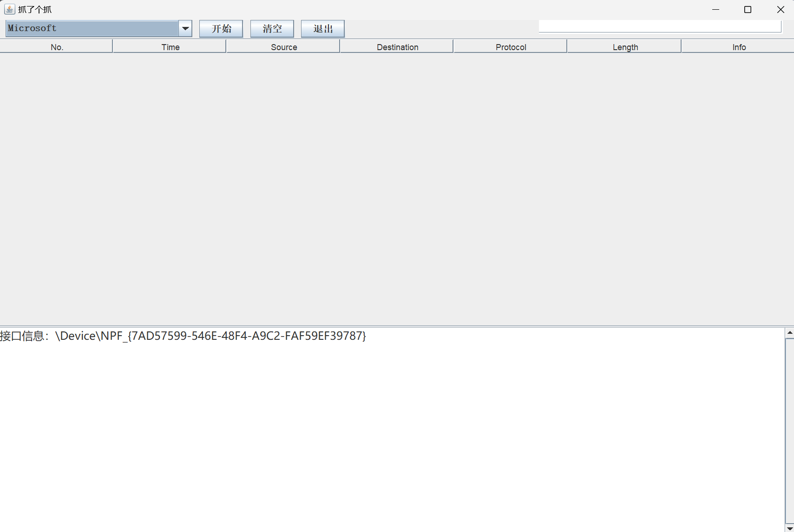
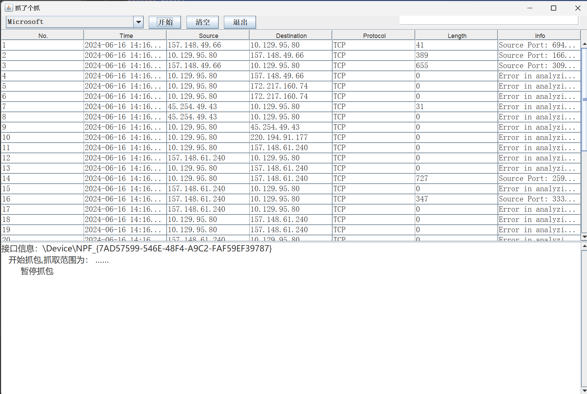
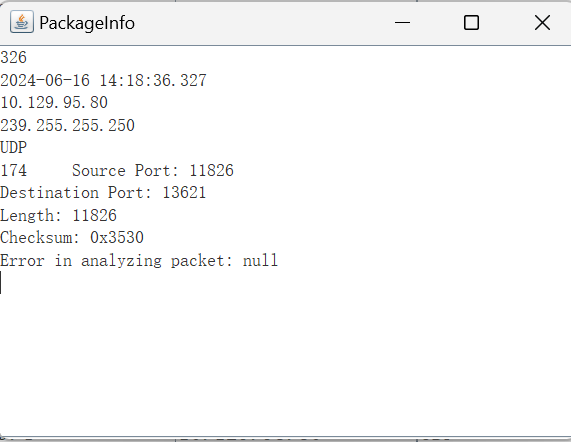

# 基于java的多线程网络抓包程序  
## 1.基本要求：  
    能实时捕获指定网络接口的数据包；  
    能通过设置仅捕获指定IP的数据包；  
    能对捕获的数据包进行解析，提取出协议的头部、数据载荷等信息。要求至少能解析网络层、传输层协议  
    图形化用户界面      
    多线程  
    开发用IDE：idea
---
## 2.设计思路：  
### 1）程序架构
    界面层: 使用Java Swing库或JavaFX库创建图形化用户界面（GUI）。界面应该包 括以下组件：
        网络接口选择框：允许用户选择要监听的网络接口。
        IP过滤器：允许用户输入要捕获的IP地址。
        开始/停止按钮：开始或停止数据包捕获。
        数据包显示区域：实时显示捕获的数据包。
    业务逻辑层: 负责处理捕获数据包的逻辑。
        数据包捕获：使用jPcap库或其他合适的库来捕获指定网络接口的数据包。
        数据包过滤：根据用户设置的IP过滤器，只捕获指定IP的数据包。
        数据包解析：解析捕获的数据包，提取网络层（如IP协议）、传输层（如TCP/UDP协议）的头部和数据载荷。
        数据包展示：将解析后的数据包信息展示在图形化界面中。
    多线程处理: 使用Java的线程模型来提高程序的性能和响应速度。
        捕获线程：负责实时捕获数据包。
        解析线程：负责解析捕获的数据包，提取头部和数据载荷。
        展示线程：负责将解析后的数据包信息实时更新到图形化界面中。
---
### 2）关键步骤
    界面设计: 使用Java Swing或JavaFX库创建图形化用户界面。
    捕获模块:
        初始化Jpcap库，并设置捕获参数。
        创建捕获线程,捕获数据包
        捕获的数据包通过管道传递给解析模块。
    解析模块:
        创建解析线程，从管道中接收数据包。
        对数据包进行解析，提取网络层和传输层的头部和数据载荷。
        将解析后的数据包信息发送给展示模块。
    展示模块:
        创建展示线程，从管道中接收解析后的数据包信息。
        将数据包信息实时更新到图形化界面中。
---
## 3.运行效果
### 前台界面
    主界面，首先通过网卡选择的下拉栏选择想要使用的接口，然后点击开始，就能进行抓包，后台会将抓到的数据包首先进行解析，然后传入，此时开始按钮变为暂停
    再次点击暂停按钮，系统停止抓包
    清空按钮能够将前台页面清空
    暂停按钮能够暂停抓包
     

    效果如图
    

    也能通过右上角的输入框来进行过滤，效果如图       
     

    双击表格，能够查看对应数据包的信息       
 
        
    在运行过程中，控制台也会不断打印信息      
 
## 4.参考文献：
### 文献部分：
---
[jPcap调用参考](https://blog.csdn.net/weixin_45395059/article/details/124743207)

---
### AI解答部分：
    1。为什么直接强转：
        在Java中，IPPacket 是 jpcap 库中的一个类，它代表了一个IP数据包。jpcap 是一个用于捕获和分析网络数据包的Java库。如果您确定一个数据包对象 packet 是一个IP数据包，那么您可以直接将它强转为 IPPacket 类型。
        通常，这种强转是安全的，前提是您已经通过某种方式确认了数据包的类型。在网络编程中，数据包通常会在捕获后进行解析，以便确定其类型（例如，IP数据包、TCP数据包、UDP数据包等）。一旦确定了数据包的类型，您就可以将其强转为相应的类类型，以便能够访问该类型特定的属性和方法。

        例如，如果您使用 jpcap 捕获了一个数据包，并且您知道您正在捕获的网络的层3协议是IP（Internet Protocol），那么您可以确信这个数据包是一个 IPPacket。在这种情况下，直接强转是安全的：

        IPPacket ip = (IPPacket) packet;
        然而，如果您不确定数据包的类型，直接强转可能会导致 ClassCastException。因此，在执行强转之前，您应该总是验证数据包的类型。这通常是通过检查数据包的某个特定字段（例如，以太网帧类型字段或IP协议字段）来完成的。

        在实际应用中，您可能会在捕获数据包后使用如下代码来检查和强转数据包类型：

        if (packet instanceof IPPacket) {
         IPPacket ip = (IPPacket) packet;
            // 现在可以安全地访问 ip 的属性和方法
        } else {
         // 数据包不是IPPacket，处理其他类型的数据包或忽略
        }
        总之，直接强转 IPPacket 是基于您对捕获的数据包类型的先验知识。只要您确信数据包是IP数据包，这种强转就是合理的。但是，为了代码的健壮性和避免运行时异常，最好在强转之前进行类型检查。

    2。jpcap中有没有能对捕获到的数据包进行分析的库函数？

    JPCap是一个用于Java语言的库，它提供了一种方便的方式来捕获和发送网络上的数据包。但是，JPCap本身并不直接提供解析捕获到的数据包的功能。它只是提供了原始数据包的捕获，而不包括数据包内容的解析。

    要解析捕获到的数据包，通常需要开发者自己来编写代码，根据不同的协议（如IP、TCP、UDP等）手动解析数据包的头部和载荷。这通常涉及到以下步骤：

    识别协议类型：首先确定数据包是IP、TCP、UDP还是其他类型的协议。
    解析协议头部：根据协议类型，解析出各个协议的头部信息，如源IP地址、目的IP地址、端口号等。
    读取数据载荷：在头部信息解析完成后，读取数据包的数据载荷部分。
    在Java中，可以使用诸如ByteBuffer之类的类来帮助处理字节的读取和转换。例如，要解析一个TCP数据包，你需要先读取IP头部以确定TCP数据段的开始位置，然后根据TCP头部信息解析出序列号、确认号、标志位等信息，最后读取TCP数据载荷。
 ---